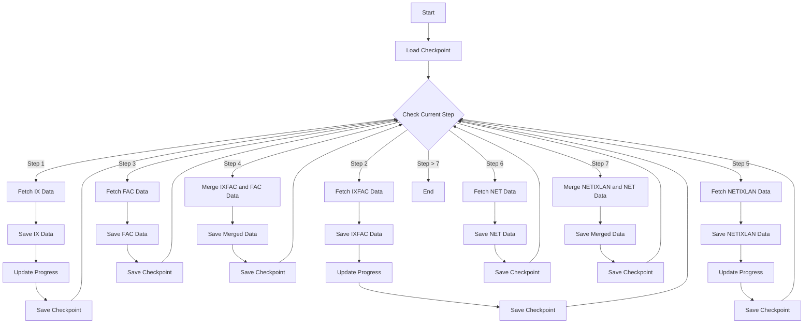

# Project Flow Diagram

This diagram represents the macro flow of the algorithm in the script. It shows the step-by-step process, including checkpointing, data fetching, saving, and merging operations. The steps are now arranged vertically and in ascending order from left to right.
