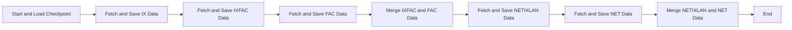
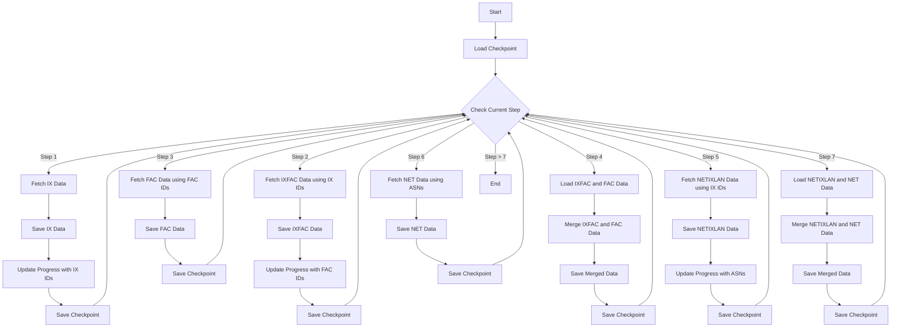

# Project Flow Diagram

## Simplified Macro Algorithm

1. Start and Load Checkpoint
2. Fetch and Save IX Data (Internet Exchange Points in Brazil)
3. Fetch and Save IXFAC Data (IX Facility Data)
4. Fetch and Save FAC Data (Facility Data)
5. Merge IXFAC and FAC Data
6. Fetch and Save NETIXLAN Data (Network to IX Connection Data)
7. Fetch and Save NET Data (Network Information)
8. Merge NETIXLAN and NET Data
9. End

This simplified version provides a high-level overview of the main steps in the data collection and processing pipeline, omitting the repetitive checkpoint and progress update steps for clarity. The diagram above visually represents this simplified flow.

## Detailed Algorithm Diagram

Este diagrama representa um fluxo mais detalhado do algoritmo no script, incluindo os passos onde os dados são obtidos de um checkpoint para fazer diversas chamadas em outro checkpoint e depois realizar a mesclagem dos dados.

Explicação do fluxo detalhado:

1. O processo começa carregando o checkpoint atual.
2. Em cada etapa, o script verifica o passo atual no checkpoint.
3. No Passo 1, os dados IX são buscados e salvos, e os IDs IX são armazenados no progresso do checkpoint.
4. No Passo 2, os dados IXFAC são buscados usando os IDs IX do checkpoint anterior, e os IDs FAC são armazenados no progresso.
5. No Passo 3, os dados FAC são buscados usando os IDs FAC do checkpoint anterior.
6. No Passo 4, os dados IXFAC e FAC são carregados dos arquivos CSV salvos e mesclados.
7. No Passo 5, os dados NETIXLAN são buscados usando os IDs IX, e os ASNs são armazenados no progresso.
8. No Passo 6, os dados NET são buscados usando os ASNs do checkpoint anterior.
9. No Passo 7, os dados NETIXLAN e NET são carregados dos arquivos CSV salvos e mesclados.

Após cada etapa, o checkpoint é atualizado com o progresso atual, permitindo que o script retome a execução a partir do último ponto concluído em caso de interrupção. Este fluxo detalhado mostra como os dados de checkpoints anteriores são utilizados para buscar informações adicionais e como os dados são mesclados em etapas subsequentes.

