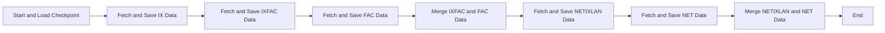
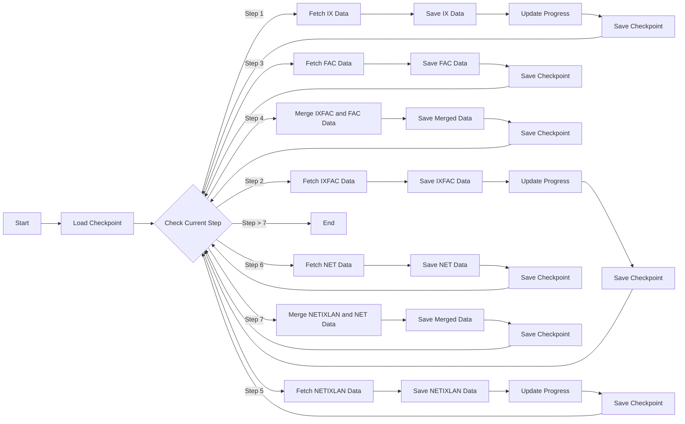

# Project Flow Diagram

## Simplified Macro Algorithm

1. Start and Load Checkpoint
2. Fetch and Save IX Data (Internet Exchange Points in Brazil)
3. Fetch and Save IXFAC Data (IX Facility Data)
4. Fetch and Save FAC Data (Facility Data)
5. Merge IXFAC and FAC Data
6. Fetch and Save NETIXLAN Data (Network to IX Connection Data)
7. Fetch and Save NET Data (Network Information)
8. Merge NETIXLAN and NET Data
9. End

This simplified version provides a high-level overview of the main steps in the data collection and processing pipeline, omitting the repetitive checkpoint and progress update steps for clarity. The diagram above visually represents this simplified flow.

## Diagram

This diagram represents the macro flow of the algorithm in the script. It shows the step-by-step process, including checkpointing, data fetching, saving, and merging operations. The steps are now arranged vertically and in ascending order from left to right.

