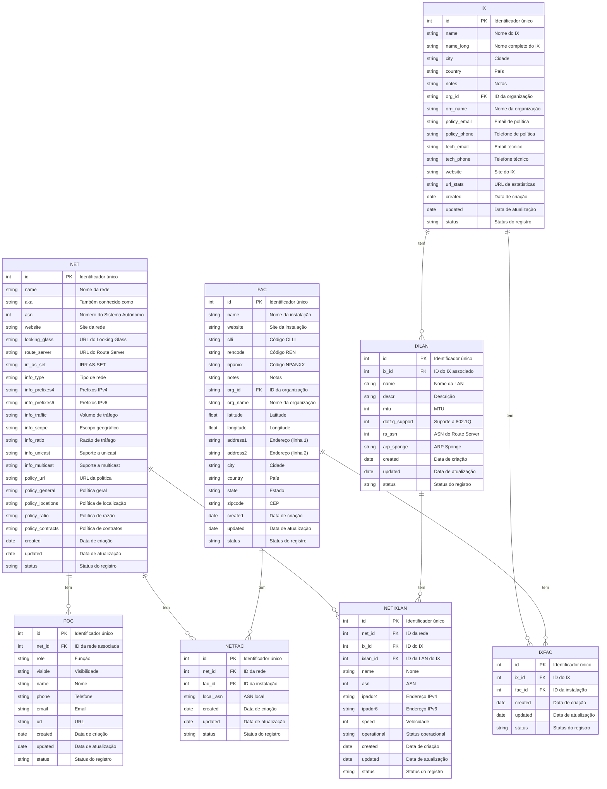
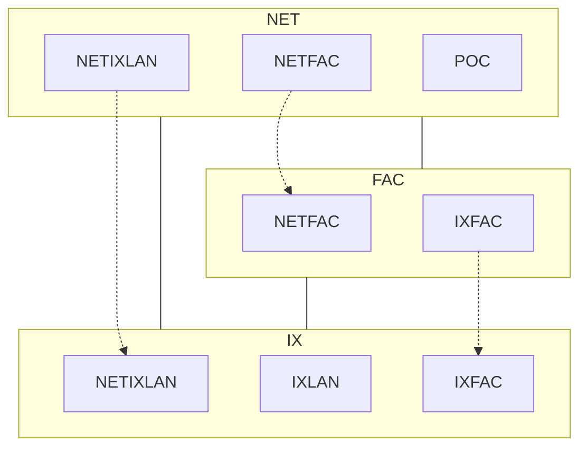
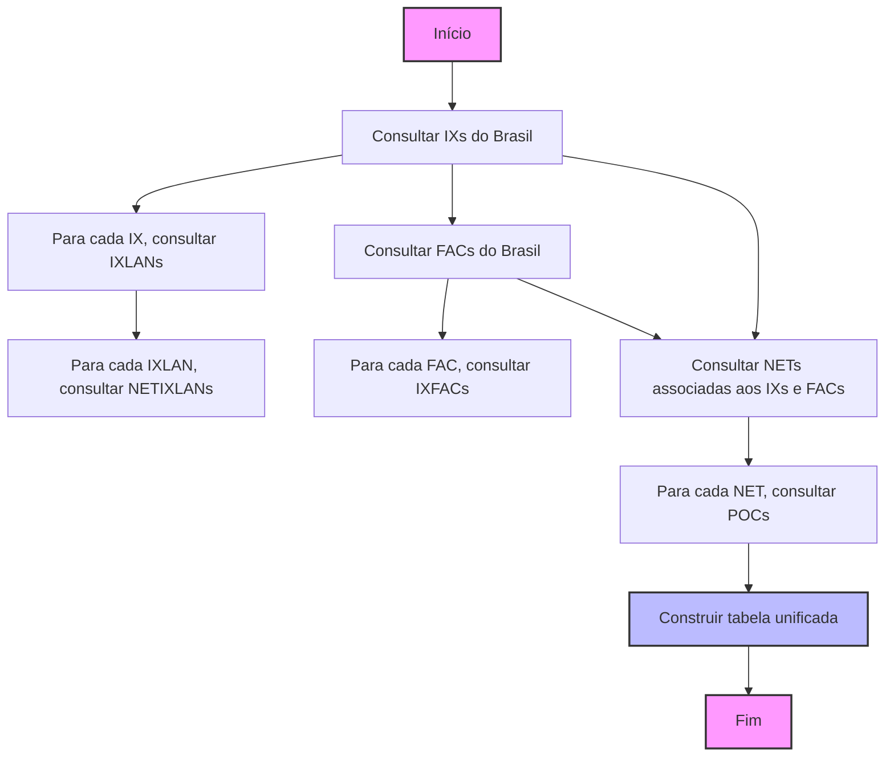

# Diagrama de Entidade Relacionamento da API do PeeringDB



Este diagrama representa as principais entidades e seus relacionamentos na API do PeeringDB. Cada entidade inclui seus atributos mais relevantes, agrupados por categoria e com descrições breves. Os endpoints principais são:

1. /net (Redes)
2. /fac (Instalações)
3. /ix (Pontos de Troca de Internet)
4. /ixlan (LANs de IX)
5. /netfac (Relação entre Redes e Instalações)
6. /netixlan (Relação entre Redes e LANs de IX)
7. /poc (Pontos de Contato)
8. /ixfac (Relação entre IXs e Instalações)

Cada um desses endpoints permite operações CRUD (Create, Read, Update, Delete) através de requisições HTTP apropriadas.

Legenda:
- PK: Chave Primária (Primary Key)
- FK: Chave Estrangeira (Foreign Key)

## Diagrama de Relações entre Entidades do PeeringDB

A seguir, apresentamos um diagrama Mermaid que representa as relações entre as principais entidades do PeeringDB:



Este diagrama Mermaid mostra as seguintes relações:

1. NET (Redes) contém:
   - NETFAC: Relação entre Redes e Instalações
   - NETIXLAN: Relação entre Redes e LANs de IX
   - POC: Pontos de Contato das Redes

2. FAC (Instalações) contém:
   - NETFAC: Relação entre Redes e Instalações
   - IXFAC: Relação entre IXs e Instalações

3. IX (Pontos de Troca de Internet) contém:
   - IXLAN: LANs de IX
   - IXFAC: Relação entre IXs e Instalações
   - NETIXLAN: Relação entre Redes e LANs de IX

4. A interseção entre NET e FAC é representada por NETFAC
5. A interseção entre FAC e IX é representada por IXFAC
6. A interseção entre NET e IX é representada por NETIXLAN, que está ligada a IXLAN

Esta representação ajuda a visualizar como as diferentes entidades do PeeringDB se relacionam entre si, destacando as entidades de junção (NETFAC, NETIXLAN, IXFAC) que conectam as entidades principais (NET, FAC, IX).

## Fluxo Ideal de Consultas para Dados do Brasil

Para obter uma única tabela com todos os dados de IX, FAC e NET do Brasil (BR), siga este fluxo de consultas:

1. Consultar IXs do Brasil:
   ```
   GET /ix?country=BR
   ```
   Atributos relevantes: id, name, city, country, org_id

2. Para cada IX, consultar IXLANs associadas:
   ```
   GET /ixlan?ix_id={ix_id}
   ```
   Atributos relevantes: id, ix_id, name

3. Para cada IXLAN, consultar NETIXLANs associadas:
   ```
   GET /netixlan?ixlan_id={ixlan_id}
   ```
   Atributos relevantes: id, net_id, ix_id, ixlan_id, asn, ipaddr4, ipaddr6, speed

4. Consultar FACs do Brasil:
   ```
   GET /fac?country=BR
   ```
   Atributos relevantes: id, name, city, country, org_id

5. Para cada FAC, consultar IXFACs associados:
   ```
   GET /ixfac?fac_id={fac_id}
   ```
   Atributos relevantes: id, ix_id, fac_id

6. Consultar NETs associadas aos IXs e FACs do Brasil:
   ```
   GET /net?ix_id={ix_id1},{ix_id2},...&fac_id={fac_id1},{fac_id2},...
   ```
   Atributos relevantes: id, name, asn, info_type, policy_general

7. Para cada NET, consultar POCs associados:
   ```
   GET /poc?net_id={net_id}
   ```
   Atributos relevantes: id, net_id, role, name, email, phone

Com essas consultas, você pode construir uma tabela unificada com as seguintes colunas:

1. IX: id, name, city, country, org_id
2. IXLAN: id, ix_id, name
3. NETIXLAN: id, net_id, ix_id, ixlan_id, asn, ipaddr4, ipaddr6, speed
4. FAC: id, name, city, country, org_id
5. IXFAC: id, ix_id, fac_id
6. NET: id, name, asn, info_type, policy_general
7. POC: id, net_id, role, name, email, phone

Esta tabela unificada fornecerá uma visão abrangente da infraestrutura de interconexão no Brasil, incluindo pontos de troca de internet, instalações, redes participantes e seus pontos de contato.

## Diagrama do Fluxo de Consultas para Dados do Brasil

O seguinte diagrama Mermaid ilustra o fluxo de consultas para obter dados do Brasil:



Este diagrama mostra a sequência de consultas necessárias para obter todos os dados relevantes do Brasil, começando com os IXs e FACs, e então obtendo as informações relacionadas de IXLANs, NETIXLANs, IXFACs, NETs e POCs. O processo termina com a construção da tabela unificada que contém todas as informações coletadas.
