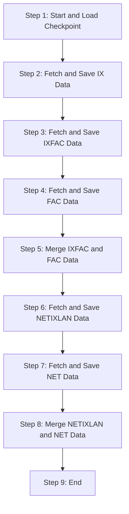
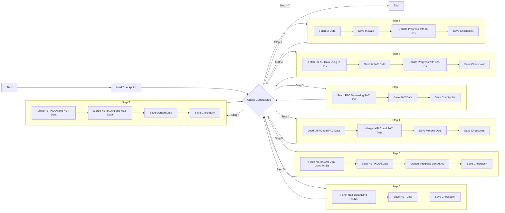

# Project Flow Diagram

## Simplified Macro Algorithm

1. Start and Load Checkpoint
2. Fetch and Save IX Data (Internet Exchange Points in Brazil)
3. Fetch and Save IXFAC Data (IX Facility Data)
4. Fetch and Save FAC Data (Facility Data)
5. Merge IXFAC and FAC Data
6. Fetch and Save NETIXLAN Data (Network to IX Connection Data)
7. Fetch and Save NET Data (Network Information)
8. Merge NETIXLAN and NET Data
9. End

This simplified version provides a high-level overview of the main steps in the data collection and processing pipeline, omitting the repetitive checkpoint and progress update steps for clarity. The diagram above visually represents this simplified flow.

## Detailed Algorithm Diagram

This diagram represents a more detailed flow of the algorithm in the script, including the steps where data is retrieved from one checkpoint to make multiple calls in another checkpoint and then merge the data.

Explanation of the detailed flow:

1. The process begins by loading the current checkpoint.
2. At each stage, the script checks the current step in the checkpoint.
3. In Step 1, IX data is fetched and saved, and IX IDs are stored in the checkpoint progress.
4. In Step 2, IXFAC data is fetched using IX IDs from the previous checkpoint, and FAC IDs are stored in the progress.
5. In Step 3, FAC data is fetched using FAC IDs from the previous checkpoint.
6. In Step 4, IXFAC and FAC data are loaded from saved CSV files and merged.
7. In Step 5, NETIXLAN data is fetched using IX IDs, and ASNs are stored in the progress.
8. In Step 6, NET data is fetched using ASNs from the previous checkpoint.
9. In Step 7, NETIXLAN and NET data are loaded from saved CSV files and merged.

After each step, the checkpoint is updated with the current progress, allowing the script to resume execution from the last completed point in case of interruption. This detailed flow shows how data from previous checkpoints is used to fetch additional information and how data is merged in subsequent steps.

