# Projeto de Extração e Análise de Dados do PeeringDB e IX.BR

## Descrição Geral

Este projeto tem como objetivo extrair, processar e analisar dados relacionados a peering de internet no Brasil. O projeto é dividido em duas partes principais: extração de dados do PeeringDB e extração de dados do IX.BR (Internet Exchange Brasil). O objetivo final é criar uma base de dados unificada e rica em informações sobre a infraestrutura de interconexão de internet no Brasil.

## Parte 1: Dados PeeringDB

### Visão Geral

O módulo `1_peeringdb_extract_data.py` é responsável por extrair dados da API do PeeringDB, focando em informações relevantes para o cenário brasileiro de peering.

### Fluxo de Trabalho


### Detalhes do Processo

1. **Configuração Inicial**
   - Carrega variáveis de ambiente (SECRET_KEY)
   - Configura autenticação com a API do PeeringDB
   - Define constantes como MAX_RETRIES, INITIAL_BACKOFF, e MAX_IDS_PER_REQUEST

2. **Extração de Dados**
   - IXs (Internet Exchanges) do Brasil: Obtém informações sobre pontos de troca de tráfego no Brasil
   - IXLANs (IX Local Area Networks): Redes locais associadas aos IXs
   - NETIXLANs (Network to IX connections): Conexões entre redes e IXs
   - FACs (Facilities) no Brasil: Instalações físicas que hospedam equipamentos de rede
   - IXFACs (IX to Facility connections): Conexões entre IXs e instalações
   - NETs (Networks): Redes participantes
   - POCs (Points of Contact): Informações de contato das redes

3. **Processamento e Armazenamento**
   - Cada conjunto de dados é salvo em um arquivo CSV separado (ex: peeringdb_ix_data.csv)
   - Implementa sistema de checkpoint para retomar operações interrompidas, salvando o progresso em .checkpoint.json

4. **Construção da Tabela Unificada**
   - Combina todos os dados extraídos em uma única tabela
   - Realiza limpeza e formatação dos dados, removendo duplicatas e renomeando colunas
   - Salva a tabela unificada em peeringdb_unified_data.csv

### Características Principais

- Uso de retry mechanism para lidar com limites de taxa da API (MAX_RETRIES e INITIAL_BACKOFF)
- Paginação para lidar com grandes conjuntos de dados (parâmetros skip e limit)
- Processamento em lotes para otimizar as requisições à API (MAX_IDS_PER_REQUEST)
- Tratamento de erros e logging para facilitar a depuração


### Diagrama de Entidade Relacionamento da API do PeeringDB

```mermaid
erDiagram
    NET ||--o{ NETFAC : "tem"
    NET ||--o{ NETIXLAN : "tem"
    NET ||--o{ POC : "tem"
    FAC ||--o{ NETFAC : "tem"
    IX ||--o{ IXLAN : "tem"
    IX ||--o{ IXFAC : "tem"
    IXLAN ||--o{ NETIXLAN : "tem"
    FAC ||--o{ IXFAC : "tem"

    NET {
        %% Identificação
        int id PK "Identificador único"
        string name "Nome da rede"
        string aka "Também conhecido como"
        int asn "Número do Sistema Autônomo"
        
        %% Informações gerais
        string website "Site da rede"
        string looking_glass "URL do Looking Glass"
        string route_server "URL do Route Server"
        string irr_as_set "IRR AS-SET"
        
        %% Informações técnicas
        string info_type "Tipo de rede"
        string info_prefixes4 "Prefixos IPv4"
        string info_prefixes6 "Prefixos IPv6"
        string info_traffic "Volume de tráfego"
        string info_scope "Escopo geográfico"
        string info_ratio "Razão de tráfego"
        string info_unicast "Suporte a unicast"
        string info_multicast "Suporte a multicast"
        
        %% Políticas
        string policy_url "URL da política"
        string policy_general "Política geral"
        string policy_locations "Política de localização"
        string policy_ratio "Política de razão"
        string policy_contracts "Política de contratos"
        
        %% Metadados
        date created "Data de criação"
        date updated "Data de atualização"
        string status "Status do registro"
    }

    FAC {
        %% Identificação
        int id PK "Identificador único"
        string name "Nome da instalação"
        
        %% Informações gerais
        string website "Site da instalação"
        string clli "Código CLLI"
        string rencode "Código REN"
        string npanxx "Código NPANXX"
        string notes "Notas"
        
        %% Organização
        string org_id FK "ID da organização"
        string org_name "Nome da organização"
        
        %% Localização
        float latitude "Latitude"
        float longitude "Longitude"
        string address1 "Endereço (linha 1)"
        string address2 "Endereço (linha 2)"
        string city "Cidade"
        string country "País"
        string state "Estado"
        string zipcode "CEP"
        
        %% Metadados
        date created "Data de criação"
        date updated "Data de atualização"
        string status "Status do registro"
    }

    IX {
        %% Identificação
        int id PK "Identificador único"
        string name "Nome do IX"
        string name_long "Nome completo do IX"
        
        %% Localização
        string city "Cidade"
        string country "País"
        
        %% Informações gerais
        string notes "Notas"
        string org_id FK "ID da organização"
        string org_name "Nome da organização"
        
        %% Contatos
        string policy_email "Email de política"
        string policy_phone "Telefone de política"
        string tech_email "Email técnico"
        string tech_phone "Telefone técnico"
        
        %% URLs
        string website "Site do IX"
        string url_stats "URL de estatísticas"
        
        %% Metadados
        date created "Data de criação"
        date updated "Data de atualização"
        string status "Status do registro"
    }

    IXLAN {
        %% Identificação
        int id PK "Identificador único"
        int ix_id FK "ID do IX associado"
        string name "Nome da LAN"
        
        %% Informações técnicas
        string descr "Descrição"
        int mtu "MTU"
        int dot1q_support "Suporte a 802.1Q"
        int rs_asn "ASN do Route Server"
        string arp_sponge "ARP Sponge"
        
        %% Metadados
        date created "Data de criação"
        date updated "Data de atualização"
        string status "Status do registro"
    }

    NETFAC {
        %% Identificação
        int id PK "Identificador único"
        int net_id FK "ID da rede"
        int fac_id FK "ID da instalação"
        
        %% Informações técnicas
        string local_asn "ASN local"
        
        %% Metadados
        date created "Data de criação"
        date updated "Data de atualização"
        string status "Status do registro"
    }

    NETIXLAN {
        %% Identificação
        int id PK "Identificador único"
        int net_id FK "ID da rede"
        int ix_id FK "ID do IX"
        int ixlan_id FK "ID da LAN do IX"
        string name "Nome"
        
        %% Informações técnicas
        int asn "ASN"
        string ipaddr4 "Endereço IPv4"
        string ipaddr6 "Endereço IPv6"
        int speed "Velocidade"
        string operational "Status operacional"
        
        %% Metadados
        date created "Data de criação"
        date updated "Data de atualização"
        string status "Status do registro"
    }

    POC {
        %% Identificação
        int id PK "Identificador único"
        int net_id FK "ID da rede associada"
        
        %% Informações de contato
        string role "Função"
        string visible "Visibilidade"
        string name "Nome"
        string phone "Telefone"
        string email "Email"
        string url "URL"
        
        %% Metadados
        date created "Data de criação"
        date updated "Data de atualização"
        string status "Status do registro"
    }

    IXFAC {
        %% Identificação
        int id PK "Identificador único"
        int ix_id FK "ID do IX"
        int fac_id FK "ID da instalação"
        
        %% Metadados
        date created "Data de criação"
        date updated "Data de atualização"
        string status "Status do registro"
    }
```



Este diagrama representa as principais entidades e seus relacionamentos na API do PeeringDB. Cada entidade inclui seus atributos mais relevantes, agrupados por categoria e com descrições breves. Os endpoints principais são:

1. /net (Redes)
2. /fac (Instalações)
3. /ix (Pontos de Troca de Internet)
4. /ixlan (LANs de IX)
5. /netfac (Relação entre Redes e Instalações)
6. /netixlan (Relação entre Redes e LANs de IX)
7. /poc (Pontos de Contato)
8. /ixfac (Relação entre IXs e Instalações)

Cada um desses endpoints permite operações CRUD (Create, Read, Update, Delete) através de requisições HTTP apropriadas.

Legenda:
- PK: Chave Primária (Primary Key)
- FK: Chave Estrangeira (Foreign Key)

### Diagrama de Relações entre Entidades do PeeringDB via API

A seguir, apresentamos um diagrama que representa as relações entre as principais entidades do PeeringDB:


Este diagrama mostra as seguintes relações:

1. NET (Redes) contém:
   - NETFAC: Relação entre Redes e Instalações
   - NETIXLAN: Relação entre Redes e LANs de IX
   - POC: Pontos de Contato das Redes

2. FAC (Instalações) contém:
   - NETFAC: Relação entre Redes e Instalações
   - IXFAC: Relação entre IXs e Instalações

3. IX (Pontos de Troca de Internet) contém:
   - IXLAN: LANs de IX
   - IXFAC: Relação entre IXs e Instalações
   - NETIXLAN: Relação entre Redes e LANs de IX

4. A interseção entre NET e FAC é representada por NETFAC
5. A interseção entre FAC e IX é representada por IXFAC
6. A interseção entre NET e IX é representada por NETIXLAN, que está ligada a IXLAN

Esta representação ajuda a visualizar como as diferentes entidades do PeeringDB se relacionam entre si, destacando as entidades de junção (NETFAC, NETIXLAN, IXFAC) que conectam as entidades principais (NET, FAC, IX).

## Fluxo Ideal de Consultas para Dados do Brasil

Para obter uma única tabela com todos os dados de IX, FAC e NET do Brasil (BR), siguimos este fluxo de consultas:

1. Consultar IXs do Brasil:
   ```
   GET /ix?country=BR
   ```
   Atributos relevantes: id, name, city, country, org_id

2. Para cada IX, consultar IXLANs associadas:
   ```
   GET /ixlan?ix_id={ix_id}
   ```
   Atributos relevantes: id, ix_id, name

3. Para cada IXLAN, consultar NETIXLANs associadas:
   ```
   GET /netixlan?ixlan_id={ixlan_id}
   ```
   Atributos relevantes: id, net_id, ix_id, ixlan_id, asn, ipaddr4, ipaddr6, speed

4. Consultar FACs do Brasil:
   ```
   GET /fac?country=BR
   ```
   Atributos relevantes: id, name, city, country, org_id

5. Para cada FAC, consultar IXFACs associados:
   ```
   GET /ixfac?fac_id={fac_id}
   ```
   Atributos relevantes: id, ix_id, fac_id

6. Consultar NETs associadas aos IXs e FACs do Brasil:
   ```
   GET /net?ix_id={ix_id1},{ix_id2},...&fac_id={fac_id1},{fac_id2},...
   ```
   Atributos relevantes: id, name, asn, info_type, policy_general

7. Para cada NET, consultar POCs associados:
   ```
   GET /poc?net_id={net_id}
   ```
   Atributos relevantes: id, net_id, role, name, email, phone

Com essas consultas, construimos uma tabela unificada com as seguintes colunas:

1. IX: id, name, city, country, org_id
2. IXLAN: id, ix_id, name
3. NETIXLAN: id, net_id, ix_id, ixlan_id, asn, ipaddr4, ipaddr6, speed
4. FAC: id, name, city, country, org_id
5. IXFAC: id, ix_id, fac_id
6. NET: id, name, asn, info_type, policy_general

Esta tabela unificada fornecerá uma visão abrangente da infraestrutura de interconexão no Brasil, incluindo pontos de troca de internet, instalações, redes participantes e seus pontos de contato.

## Diagrama do Fluxo de Consultas para Dados do Brasil

O seguinte diagrama ilustra o fluxo de consultas para obter dados do Brasil:


Este diagrama mostra a sequência de consultas necessárias para obter todos os dados relevantes do Brasil, começando com os IXs e FACs, e então obtendo as informações relacionadas de IXLANs, NETIXLANs, IXFACs, NETs e POCs. O processo termina com a construção da tabela unificada que contém todas as informações coletadas.

## Diagrama de Algoritmo Detalhado


Este diagrama representa um fluxo mais detalhado do algoritmo no script, incluindo as etapas em que os dados são recuperados de um ponto de verificação para fazer várias chamadas em outro ponto de verificação e, em seguida, mesclar os dados.

Explicação do fluxo detalhado:

1. O processo começa carregando o ponto de verificação atual.
2. Em cada estágio, o script verifica a etapa atual no ponto de verificação.
3. Na Etapa 1, os dados IX são buscados e salvos, e os IDs IX são armazenados no progresso do ponto de verificação.
4. Na Etapa 2, os dados IXFAC são buscados usando IDs IX do ponto de verificação anterior, e os IDs FAC são armazenados no progresso.
5. Na Etapa 3, os dados FAC são buscados usando IDs FAC do ponto de verificação anterior.
6. Na Etapa 4, os dados IXFAC e FAC são carregados de arquivos CSV salvos e mesclados.
7. Na Etapa 5, os dados NETIXLAN são buscados usando IDs IX, e os ASNs são armazenados no progresso.
8. Na Etapa 6, os dados NET são buscados usando ASNs do ponto de verificação anterior.
9. Na Etapa 7, os dados NETIXLAN e NET são carregados de arquivos CSV salvos e mesclados.

Após cada etapa, o ponto de verificação é atualizado com o progresso atual, permitindo que o script retome a execução do último ponto concluído em caso de interrupção. Este fluxo detalhado mostra como os dados de pontos de verificação anteriores são usados ​​para buscar informações adicionais e como os dados são mesclados em etapas subsequentes.


## Parte 2: Dados IX.BR

### Visão Geral

Esta parte do projeto consiste em vários scripts (2 a 7) que extraem e processam dados específicos do IX.BR.

### Módulos e Funções

1. **2_ix-br_entities_extract_data.py**
   - Extrai informações sobre entidades participantes do IX.BR
   - Funções principais:
     - `get_city_info`: Obtém informações sobre cidades participantes
     - `get_company_data`: Coleta dados sobre empresas participantes
     - `process_company_data`: Processa os dados das empresas
     - `parse_gpt_response`: Analisa respostas de um modelo GPT (se utilizado)

2. **3_ix-br_slugs_extract_data.py**
   - Processa dados relacionados a slugs (identificadores únicos) do IX.BR
   - Funções principais:
     - `get_city_info`: Similar ao script anterior, mas focado em slugs
     - `get_company_data`: Coleta dados específicos de slugs
     - `extract_map_data`: Extrai dados de mapas relacionados aos slugs

3. **4_ix-br_charts_images_download.py**
   - Baixa imagens de gráficos do IX.BR
   - Funções principais:
     - `select_graph_type`: Permite selecionar o tipo de gráfico a ser baixado
     - `download_image`: Realiza o download das imagens dos gráficos
     - `process_csv`: Processa um arquivo CSV para determinar quais imagens baixar
     - `download_city_map`: Baixa mapas de cidades específicas

4. **5_ix-br_charts_images_extract_data_.py**
   - Extrai dados das imagens de gráficos baixadas usando técnicas de IA
   - Funções principais:
     - `encode_image`: Codifica a imagem para processamento pela IA
     - `process_image`: Extrai dados da imagem usando modelos de IA avançados
     - `update_csv`: Atualiza o CSV com os dados extraídos pela IA
     - `is_row_processed`: Verifica se uma linha já foi processada

5. **6_ix-br_topologymap_images_download.py**
   - Baixa imagens de mapas de topologia do IX.BR
   - Funções principais:
     - `download_topology_map`: Baixa mapas de topologia específicos
     - `process_csv`: Processa CSV para determinar quais mapas baixar

6. **7_ix-br_topologymap_images_extract_data.py**
   - Extrai dados das imagens de mapas de topologia
   - Funções similares ao script 5, mas focadas em mapas de topologia
   **OBS: O modelo de IA utilizado não conseguiu extrair com precisão os dados dessas imagens, então não utilizamos os dados extraídos automaticamente e realizamos extração manual para o projeto**

### Fluxo de Trabalho Geral


### Características Principais

- Automação do processo de coleta de dados do IX.BR
- Processamento avançado de imagens usando IA para extração de informações
  - Utilização de modelos de visão computacional e OCR de última geração
  - Implementação de redes neurais convolucionais (CNN) para análise de gráficos
  - Uso de técnicas de processamento de linguagem natural (NLP) para interpretação de textos em gráficos
- Integração de dados de diferentes fontes do IX.BR
- Uso de técnicas de web scraping já que o IX.BR não fornece API.
- Tratamento de erros e retentativas para garantir a coleta completa dos dados
- Sistema de aprendizado contínuo para melhorar a precisão da extração de dados ao longo do tempo

---

## Conclusão

Este projeto fornece uma visão abrangente da infraestrutura de peering no Brasil, combinando dados do PeeringDB e do IX.BR. A automação da coleta e processamento de dados permite uma análise atualizada e detalhada do cenário de interconexão de internet no país.

Os dados coletados e processados por este projeto podem ser utilizados para:
- Análise de tendências de crescimento da infraestrutura de internet no Brasil
- Identificação de oportunidades de peering
- Estudos sobre a distribuição geográfica de pontos de troca de tráfego
- Avaliação da robustez e redundância da rede de internet brasileira
- Comparação de desempenho entre diferentes IXs e participantes
- Planejamento estratégico para expansão de redes e infraestrutura

### Próximos Passos

1. Implementar visualizações interativas dos dados coletados
2. Desenvolver análises preditivas para prever tendências futuras
3. Criar um dashboard para monitoramento em tempo real
4. Expandir o projeto para incluir dados de outros países da América Latina
5. Integrar machine learning para identificar padrões e anomalias nos dados coletados
